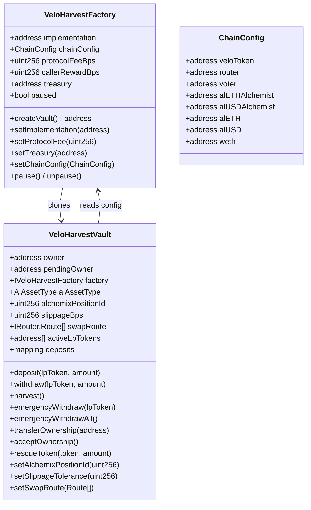

# VeloLP Harvest — Factory + Vault Contract System

## Project Overview

This project builds a **Solidity contract system** centered on two main contracts:

1. **VeloHarvestFactory** — Deploys per-user vault clones (EIP-1167 minimal proxies), manages global configuration (chain addresses, protocol fee, caller reward), and serves as the admin-controlled registry.
2. **VeloHarvestVault** (implementation) — Each user's clone accepts multiple Velodrome LP tokens, stakes them in the corresponding gauge contracts, claims VELO rewards, swaps VELO to alAsset (alETH or alUSD) via the Velodrome router, and calls `burn()` on the Alchemix v3 Alchemist contract to pay down the user's debt.

A locally-hosted **React deployment UI** allows a deployer to fill in chain-specific contract addresses and deploy the factory to any EVM chain with a Velodrome-compatible DEX.

### Key Architectural Decisions (locked in)

- **Unlimited vaults per user** via EIP-1167 minimal proxy clones (~90% gas savings vs full deploy). Users commonly create one vault per alAsset type or per LP strategy. The factory does not enforce uniqueness.
- **Multiple LP tokens per vault** (capped at 10 for gas safety during harvest)
- **One alAsset type per vault** (alETH or alUSD, chosen at vault creation)
- **Alchemix position NFT ID** set at vault creation, updatable later by owner
- **Harvest triggers:** (a) `deposit()` auto-harvests (reverts if harvest fails); `withdraw()` attempts harvest when unpaused (proceeds regardless of harvest outcome), (b) public `harvest()` with configurable VELO reward to caller (default 0.5%, set via factory `callerRewardBps`)
- **Harvest reward policy:** caller reward is always paid to `rewardRecipient` (passed to `_harvest()`). For public `harvest()` and `deposit()`, this is `msg.sender`. For `withdraw()`, this is the vault owner's address (passed through the self-call). No special-casing within `_harvest()` itself.
- **Sweep-all harvest model:** harvest processes all VELO currently held by the vault (`balanceOf`), not just newly claimed rewards. Previously accumulated VELO from no-debt skips is included.
- **Protocol fee:** configurable by factory admin (e.g. 0.5-2%), paid in VELO before swap
- **Slippage:** user-configurable per vault, default 0.5% (50 bps)
- **No-debt edge case:** if user has no Alchemix debt, VELO rewards are claimed but NOT swapped; held in vault until debt exists or user recovers them via `rescueToken()`
- **Emergency withdraw:** unstakes and returns only gauge-withdrawn LP tokens immediately, skipping harvest; any directly donated LP tokens remain in the vault for `rescueToken()`
- **Vault ownership transfer:** two-step transfer (`transferOwnership` + `acceptOwnership`), mirroring Ownable2Step pattern
- **Rescue function:** owner can rescue any ERC-20 sent to the vault except actively staked LP principal
- **Admin role:** Ownable2Step with pause capability; admin can update implementation (for future clones), set fees, pause. Transition to pause-only by transferring ownership to a restricted contract later.
- **Fee-on-transfer LP tokens are not supported.** The vault uses `amount` as both the transfer input and the deposited amount. If an LP token charges a transfer fee, internal accounting will be incorrect.
- **Withdraw harvest resilience (self-call pattern):** `withdraw()` attempts harvest via an external self-call: `try this._harvestForWithdraw(msg.sender) { ... } catch { emit HarvestSkipped(...); }`. The `_harvestForWithdraw(address rewardRecipient)` function is `external` (enabling try/catch, which only works on external calls), NOT `nonReentrant` (because `withdraw()` already holds the reentrancy lock), and guarded by `require(msg.sender == address(this))` to prevent arbitrary external callers. The `rewardRecipient` parameter passes the vault owner's address through to `_harvest()`, because `msg.sender` changes to `address(this)` in Solidity external self-calls. If harvest fails for any reason (broken route, external revert, etc.), the catch block ensures withdrawal proceeds anyway. When paused, `withdraw()` skips harvest entirely (no self-call). `deposit()` calls `_harvest(msg.sender)` directly without resilience -- deposit is intentionally allowed to fail if the harvest path is broken (see "Deposit harvest dependency" below). This guarantees users can always exit regardless of harvest path health.
- **Deposit harvest dependency:** `deposit()` calls `_harvest(msg.sender)` directly (not via the resilient self-call path). If the harvest path is broken (bad swap route, router failure, etc.), deposits with existing LP positions will revert. This is a conscious design choice: deposits are a non-emergency operation, and the owner can fix the route/config or use `setSwapRoute()` before depositing more. In contrast, `withdraw()` is always resilient.
- **Gauge compatibility requirement:** supported deployments must use gauge implementations compatible with `IGauge` as defined in this project. Gauges with multiple reward tokens or non-VELO rewards are incompatible and unsupported. This is a deployment prerequisite, not merely an assumption.
- **Approval strategy:** all token approvals use `forceApprove` (OZ v5) to handle tokens that require approve-to-zero before setting a new allowance. This is the single canonical approval pattern used throughout.
- **Framework:** Foundry (forge/cast/anvil) — Solidity-native testing, built-in fork testing, modern standard
- **Target:** Optimism first, chain-portable to Base (Aerodrome) and other Velodrome forks later
- **Portability scope:** "Chain-portable" means deployable on any EVM chain with a Velodrome-compatible DEX that uses a single primary reward token distributed by gauges. The contract naming (`veloToken`, `HarvestCompleted`, etc.) reflects the Optimism-first design but the token address is configurable via `ChainConfig.veloToken`. Forks with fundamentally different gauge models (e.g., multiple reward tokens per gauge) are out of scope. See "Gauge compatibility requirement" below and in Milestone 0.4.
- **Building ahead of Alchemix v3** — alchemist address can be `address(0)` initially; vault gracefully skips burn when not set

### High-Level Data Flow

```mermaid
sequenceDiagram
    participant User
    participant Factory as VeloHarvestFactory
    participant Vault as VeloHarvestVault (Clone)
    participant Gauge as Velodrome Gauge
    participant Router as Velodrome Router
    participant Alchemist as AlchemistV3

    User->>Factory: createVault(alAssetType, positionId, slippage)
    Factory->>Vault: Clones.clone(implementation)
    Factory->>Vault: initialize(owner, factory, config)

    User->>Vault: deposit(lpToken, amount)
    Vault->>Vault: _harvest(msg.sender) [auto on deposit, direct call]
    Vault->>Gauge: deposit(amount)

    Note over Vault: Time passes, VELO accrues

    User->>Vault: withdraw(lpToken, amount)
    Vault->>Vault: this._harvestForWithdraw(msg.sender) [self-call, try/catch; skip if paused]
    Vault->>Gauge: withdraw(amount)
    Vault->>User: transfer LP tokens

    Note over Vault: Harvest flow (auto or public call)
    Vault->>Gauge: getReward(vault) [for each active gauge]
    Vault->>Vault: deduct callerReward + protocolFee in VELO
    Vault->>Router: swapExactTokensForTokens(VELO -> alAsset)
    Vault->>Alchemist: burn(alAssetAmount, positionId)
```

### Contract Architecture



### File Structure

```
veloLPharvest/
├── foundry.toml
├── .env.example
├── README.md
├── project_plan.md
├── script/
│   ├── Deploy.s.sol
│   └── configs/
│       ├── OptimismConfig.sol
│       └── BaseConfig.sol
├── src/
│   ├── VeloHarvestFactory.sol
│   ├── VeloHarvestVault.sol
│   ├── interfaces/
│   │   ├── IVeloHarvestFactory.sol
│   │   ├── IVeloHarvestVault.sol
│   │   └── external/
│   │       ├── IGauge.sol
│   │       ├── IRouter.sol
│   │       ├── IVoter.sol
│   │       └── IAlchemistV3.sol
│   └── types/
│       └── DataTypes.sol
├── test/
│   ├── unit/
│   │   ├── VeloHarvestVault.t.sol
│   │   └── VeloHarvestFactory.t.sol
│   ├── fork/
│   │   └── OptimismFork.t.sol
│   ├── integration/
│   │   └── EndToEnd.t.sol
│   └── mocks/
│       ├── MockGauge.sol
│       ├── MockRouter.sol
│       ├── MockVoter.sol
│       ├── MockAlchemistV3.sol
│       └── MockERC20.sol
└── deploy-ui/
    ├── package.json
    ├── vite.config.ts
    ├── src/
    │   ├── App.tsx
    │   ├── components/
    │   │   ├── ChainConfigForm.tsx
    │   │   ├── DeployStatus.tsx
    │   │   └── NetworkSelector.tsx
    │   ├── config/
    │   │   ├── chains.ts
    │   │   └── abis.ts
    │   └── hooks/
    │       └── useDeploy.ts
    └── index.html
```

---

## Phase 0 — Project Setup and External Interfaces

### Milestone 0.1 — Initialize Foundry project and dependencies

**Branch:** `setup/foundry-init`

**What this task is**

Bootstrap the Foundry project with all dependencies, folder structure, and configuration files. No contract logic yet.

**Tasks**

- [ ] Run `forge init --no-git` in the workspace root (or `forge init` and manage git)
- [ ] Install OpenZeppelin contracts:
  - `forge install OpenZeppelin/openzeppelin-contracts`
  - `forge install OpenZeppelin/openzeppelin-contracts-upgradeable`
- [ ] Configure `foundry.toml`:
  - Set `solc_version = "0.8.25"` (or latest stable)
  - Set remappings:
    - `@openzeppelin/contracts/=lib/openzeppelin-contracts/contracts/`
    - `@openzeppelin/contracts-upgradeable/=lib/openzeppelin-contracts-upgradeable/contracts/`
  - Set `optimizer = true`, `optimizer_runs = 200`
  - Set `ffi = false`
  - Set `fs_permissions = [{ access = "read", path = "./" }]`
  - Add `[rpc_endpoints]` section with `optimism = "${OPTIMISM_RPC_URL}"`
  - Add `[etherscan]` section with `optimism = { key = "${ETHERSCAN_API_KEY}", url = "https://api-optimistic.etherscan.io/api" }`
- [ ] Create `.env.example` with:
  - `OPTIMISM_RPC_URL=https://mainnet.optimism.io`
  - `DEPLOYER_PRIVATE_KEY=` (placeholder)
  - `ETHERSCAN_API_KEY=` (placeholder)
- [ ] Create folder structure: `src/`, `src/interfaces/`, `src/interfaces/external/`, `src/types/`, `test/unit/`, `test/fork/`, `test/integration/`, `test/mocks/`, `script/`, `script/configs/`
- [ ] Create placeholder `README.md` with project description

**Done when**

- `forge build` succeeds with zero errors and zero warnings
- Folder structure matches the plan
- `.env.example` documents all required environment variables

---

### Milestone 0.2 — Define shared types and data structures

**Branch:** `setup/types-and-enums`

**What this task is**

Define the shared structs, enums, and constants used across factory and vault contracts.

**Tasks**

- [ ] Create `src/types/DataTypes.sol`:

```solidity
// SPDX-License-Identifier: MIT
pragma solidity ^0.8.25;

library DataTypes {
    enum AlAssetType { alETH, alUSD }

    struct ChainConfig {
        address veloToken;
        address router;
        address voter;
        address alETHAlchemist;
        address alUSDAlchemist;
        address alETH;
        address alUSD;
        address weth;
    }

    uint256 constant MAX_BPS = 10_000;
    uint256 constant DEFAULT_SLIPPAGE_BPS = 50; // 0.5%
    uint256 constant MAX_SLIPPAGE_BPS = 500;    // 5% max
    uint256 constant MAX_LP_TOKENS = 10;
    uint256 constant MAX_PROTOCOL_FEE_BPS = 500; // 5% max
    uint256 constant MAX_CALLER_REWARD_BPS = 200; // 2% max
}
```

**Note:** Swap routes use `IRouter.Route` as the single canonical route struct. No separate `DataTypes.Route` is defined. Import `IRouter` wherever route types are needed. If the router struct changes across chains (e.g., Aerodrome vs Velodrome), provide a conversion helper, but `IRouter.Route` remains the source of truth.

**Done when**

- `forge build` succeeds
- All enums and structs are documented with NatSpec

---

### Milestone 0.3 — Define external protocol interfaces

**Branch:** `setup/external-interfaces`

**What this task is**

Define Solidity interfaces for the external contracts this system interacts with: Velodrome Gauge, Router, Voter, and Alchemix v3 Alchemist. These are the minimum function signatures needed — not complete interfaces.

**Tasks**

- [ ] Create `src/interfaces/external/IGauge.sol`:
  - `function deposit(uint256 amount) external`
  - `function withdraw(uint256 amount) external`
  - `function getReward(address account) external`
  - `function earned(address account) external view returns (uint256)`
  - `function balanceOf(address account) external view returns (uint256)`

- [ ] Create `src/interfaces/external/IRouter.sol`:
  - Use the Velodrome V2 Router interface:
  - `struct Route { address from; address to; bool stable; address factory; }`
  - `function swapExactTokensForTokens(uint256 amountIn, uint256 amountOutMin, Route[] calldata routes, address to, uint256 deadline) external returns (uint256[] memory amounts)`
  - `function getAmountsOut(uint256 amountIn, Route[] calldata routes) external view returns (uint256[] memory amounts)`

- [ ] Create `src/interfaces/external/IVoter.sol`:
  - `function gauges(address pool) external view returns (address)`
  - `function isAlive(address gauge) external view returns (bool)`

- [ ] Create `src/interfaces/external/IAlchemistV3.sol`:
  - `function burn(uint256 amount, uint256 recipientId) external` — Burns alAssets from caller to reduce unearmarked debt on position `recipientId`. The vault must hold alAssets and approve the Alchemist to spend them before calling.
  - `function getCDP(uint256 tokenId) external view returns (uint256 debt, uint256 earmarked, uint256 collateral)` — Returns simulated up-to-date position state. Used to check if user has debt before swapping.
  - `function debtToken() external view returns (address)` — Returns the alAsset address (for verification).

**Important Alchemix v3 integration notes (from docs):**

- `burn(amount, recipientId)` burns alAsset tokens **from the caller** (msg.sender) to repay debt on position `recipientId`. Anyone can call this for any position (paying down someone's debt is always allowed). The vault must hold alAsset tokens.
- `getCDP(tokenId)` returns `(debt, earmarked, collateral)` — use `debt` to check if the user has outstanding debt before swapping.
- Positions are identified by NFT token IDs from the `AlchemistV3PositionNFT` contract.
- `burn()` reverts with `CannotRepayOnMintBlock()` if called in the same block as a mint — not relevant for this system since we never mint.
- `burn()` can only repay unearmarked debt. If all debt is earmarked, the burn amount is capped.
- The Alchemist contract must be approved to spend the vault's alAssets (via `IERC20(alAsset).approve(alchemist, amount)`).

- [ ] Create `src/interfaces/IVeloHarvestFactory.sol` — stub; fully defined in Milestone 0.4
- [ ] Create `src/interfaces/IVeloHarvestVault.sol` — stub; fully defined in Milestone 0.4

**Done when**

- All interfaces compile cleanly
- NatSpec documents each function with params and behavior
- Alchemix integration notes are preserved as comments in `IAlchemistV3.sol`

---

### Milestone 0.4 — Canonical interfaces, events, errors, and product policies

**Branch:** `setup/canonical-interfaces`

**What this task is**

Define the complete interfaces for both project contracts, all events, all custom errors, and all product policy decisions. Every later phase references this milestone as the single source of truth. This eliminates ambiguity about function signatures, pause behavior, harvest accounting, and trust assumptions.

**Tasks**

- [ ] Define complete `IVeloHarvestFactory` in `src/interfaces/IVeloHarvestFactory.sol`:

```solidity
interface IVeloHarvestFactory {
    // --- Read functions (called by vaults) ---
    function getChainConfig() external view returns (DataTypes.ChainConfig memory);
    function getProtocolFeeBps() external view returns (uint256);
    function getCallerRewardBps() external view returns (uint256);
    function getTreasury() external view returns (address);
    function paused() external view returns (bool);

    // --- Read functions (general) ---
    function implementation() external view returns (address);
    function getUserVaults(address user) external view returns (address[] memory);
    function getVaultCount() external view returns (uint256);

    // --- Write functions ---
    function createVault(
        DataTypes.AlAssetType alAssetType,
        uint256 alchemixPositionId,
        uint256 slippageBps,
        IRouter.Route[] calldata swapRoute
    ) external returns (address vault);

    // --- Admin functions ---
    function setImplementation(address newImpl) external;
    function setChainConfig(DataTypes.ChainConfig calldata newConfig) external;
    function setProtocolFee(uint256 newFeeBps) external;
    function setCallerReward(uint256 newRewardBps) external;
    function setTreasury(address newTreasury) external;
    function pause() external;
    function unpause() external;
}
```

The vault stores `factory` as `IVeloHarvestFactory`, not `address`. All pseudocode in later phases must call `factory.getChainConfig()`, never `factory.chainConfig()`.

- [ ] Define complete `IVeloHarvestVault` in `src/interfaces/IVeloHarvestVault.sol`:

```solidity
interface IVeloHarvestVault {
    // --- Initialization ---
    function initialize(
        address _owner,
        address _factory,
        DataTypes.AlAssetType _alAssetType,
        uint256 _alchemixPositionId,
        uint256 _slippageBps,
        IRouter.Route[] calldata _swapRoute
    ) external;

    // --- Deposit / Withdraw (onlyOwner) ---
    function deposit(address lpToken, uint256 amount) external;
    function withdraw(address lpToken, uint256 amount) external;
    function emergencyWithdraw(address lpToken) external;
    function emergencyWithdrawAll() external;

    // --- Harvest (public) ---
    function harvest() external returns (uint256 veloHarvested);

    // --- Token retrieval (onlyOwner) ---
    function rescueToken(address token, uint256 amount) external;

    // --- Owner config (onlyOwner) ---
    function setAlchemixPositionId(uint256 newId) external;
    function setSlippageTolerance(uint256 newBps) external;
    function setSwapRoute(IRouter.Route[] calldata newRoute) external;

    // --- Ownership transfer ---
    function transferOwnership(address newOwner) external;
    function acceptOwnership() external;

    // --- Read functions ---
    function owner() external view returns (address);
    function pendingOwner() external view returns (address);
    function factory() external view returns (IVeloHarvestFactory);
    function alAssetType() external view returns (DataTypes.AlAssetType);
    function alchemixPositionId() external view returns (uint256);
    function slippageBps() external view returns (uint256);
    function getSwapRoute() external view returns (IRouter.Route[] memory);
    function getActiveLpTokens() external view returns (address[] memory);
    function getActiveLpTokenCount() external view returns (uint256);
    function getDepositedBalance(address lpToken) external view returns (uint256);
    function getPendingRewards(address lpToken) external view returns (uint256);
    function getTotalPendingRewards() external view returns (uint256);
}
```

- [ ] Define all events for both contracts:

**Factory events:**
  - `VaultCreated(address indexed user, address indexed vault, DataTypes.AlAssetType alAssetType)`
  - `ImplementationUpdated(address indexed oldImpl, address indexed newImpl)`
  - `ChainConfigUpdated(bytes32 oldConfigHash, bytes32 newConfigHash)` -- emits keccak256 hashes of old and new config for lightweight monitoring. Off-chain monitors can compare hashes to detect changes and read full config from storage if needed.
  - `ProtocolFeeUpdated(uint256 oldFee, uint256 newFee)`
  - `CallerRewardUpdated(uint256 oldReward, uint256 newReward)`
  - `TreasuryUpdated(address indexed oldTreasury, address indexed newTreasury)`

**Vault events:**
  - `Deposited(address indexed lpToken, uint256 amount)`
  - `Withdrawn(address indexed lpToken, uint256 amount)`
  - `EmergencyWithdrawn(address indexed lpToken, uint256 amount)`
  - `HarvestCompleted(uint256 veloTotal, uint256 callerReward, uint256 protocolFee, uint256 veloPostFees)`
  - `SwappedAndBurned(uint256 veloPostFees, uint256 newlyReceived, uint256 actualBurned, uint256 alchemixPositionId)`
  - `BurnFailed(uint256 alAssetAmount, uint256 alchemixPositionId)`
  - `HarvestSkipped(uint256 veloAmount, string reason)` -- **Note:** `veloAmount` may be zero in the withdraw-catch path (`"harvest failed during withdraw"`) where harvest failed before reaching the VELO balance check. A zero `veloAmount` indicates a generic failure path where the actual VELO amount is unknown, not that zero VELO was present. In all other `HarvestSkipped` emission paths (alchemist not set, no debt, getCDP failed, debt token mismatch), `veloAmount` reflects the actual VELO amount that was not swapped.
  - `GaugeSkipped(address indexed lpToken, address indexed gauge, string reason)`
  - `TokenRescued(address indexed token, uint256 amount, address indexed to)`
  - `OwnershipTransferStarted(address indexed currentOwner, address indexed pendingOwner)`
  - `OwnershipTransferred(address indexed previousOwner, address indexed newOwner)`
  - `AlchemixPositionIdUpdated(uint256 oldId, uint256 newId)`
  - `SlippageToleranceUpdated(uint256 oldBps, uint256 newBps)`
  - `SwapRouteUpdated()`

- [ ] Define all custom errors:

```solidity
error GaugeNotFound(address lpToken);
error GaugeNotAlive(address lpToken);
error MaxLpTokensReached(uint256 max);
error InsufficientDeposit(address lpToken, uint256 requested, uint256 available);
error ZeroAmount();
error ZeroAddress();
error SlippageTooHigh(uint256 provided, uint256 max);
error FeeTooHigh(uint256 provided, uint256 max);
error InvalidSwapRoute();
error NotOwner();
error NotPendingOwner();
error CannotRescueActiveLp(address lpToken);
error VaultPaused();
error OnlySelf();
```

- [ ] Document pause semantics matrix:

| Function | Blocked while paused? |
|---|---|
| `createVault` (factory) | Yes |
| `deposit` | Yes |
| `harvest` (public) | Yes |
| `withdraw` | **No** -- users must always be able to exit |
| `emergencyWithdraw` | **No** |
| `emergencyWithdrawAll` | **No** |
| `rescueToken` | **No** |
| `setAlchemixPositionId` | **No** |
| `setSlippageTolerance` | **No** |
| `setSwapRoute` | **No** |
| `transferOwnership` | **No** |
| `acceptOwnership` | **No** |

Rationale: only state-expanding operations (new vaults, new deposits, reward processing) are paused. Users must always be able to exit and manage their vault configuration during emergencies.

**Withdraw harvest behavior when paused:** `withdraw()` is allowed while paused, but it skips harvest entirely (no self-call to `_harvestForWithdraw()`). This ensures the exit path has zero dependency on external protocol calls (router, alchemist) during emergencies. When unpaused, `withdraw()` attempts harvest via `try this._harvestForWithdraw(msg.sender) catch`; if harvest fails, withdrawal proceeds anyway. The self-call pattern is required because Solidity `try/catch` only works on external calls, not internal function calls. The `msg.sender` (vault owner) is passed as `rewardRecipient` because `msg.sender` changes to `address(this)` inside external self-calls.

- [ ] Document harvest reward policy:

**Caller reward goes to `rewardRecipient`.** `_harvest(address rewardRecipient)` always transfers the caller reward to `rewardRecipient`. The callers set this as follows:
- `harvest()` → `_harvest(msg.sender)` — public caller (keeper or owner) gets the reward
- `deposit()` → `_harvest(msg.sender)` — owner gets the reward (since deposit is onlyOwner)
- `_harvestForWithdraw(rewardRecipient)` → `_harvest(rewardRecipient)` — owner gets the reward (passed through from `withdraw()`'s `msg.sender`, because `msg.sender` changes to `address(this)` inside external self-calls)

This is consistent: the vault owner always receives the caller reward when they trigger harvest, and third-party keepers receive it when calling the public `harvest()` function.

**Permissionless harvest:** `harvest()` is callable by any address (no access restriction). The caller reward policy is identical regardless of whether the caller is the vault owner or a third-party keeper -- `_harvest(msg.sender)` is always used, and `msg.sender` receives the reward. There is no special-casing for owner vs. non-owner callers.

- [ ] Document sweep-all policy:

**Harvest uses sweep-all model.** After claiming rewards from gauges, `_harvest()` processes `IERC20(veloToken).balanceOf(address(this))` -- the entire VELO balance, including any previously accumulated VELO from no-debt skips or prior partial operations. This is intentional: when debt later appears, all accumulated VELO is processed. The user can call `rescueToken(veloToken, amount)` before a harvest to extract accumulated VELO if they want to prevent it from being swept.

**Sweep-all applies even when `activeLpTokens` is empty.** If the vault holds VELO but has no active LP positions (e.g., all LPs were withdrawn or emergency-withdrawn while VELO accumulated from prior no-debt skips), `_harvest()` still processes the VELO balance. The gauge-claim loop simply has nothing to iterate; the sweep-all balance check and fee/swap/burn logic still runs. `_harvest()` returns 0 only when the vault's total VELO balance is zero.

- [ ] Document swap route validation rules:

Route validation is enforced in `setSwapRoute()` and at vault initialization. All checks must pass or the call reverts with `InvalidSwapRoute()`:
  1. `route.length > 0`
  2. `route[0].from == veloToken` (read from factory via `factory.getChainConfig().veloToken`)
  3. `route[route.length - 1].to == targetAlAsset` (determined by `alAssetType` and factory chain config)
  4. For each `i > 0`: `route[i].from == route[i-1].to` (hop continuity)

**Zero-target alAsset handling (pre-Alchemix v3 deployment):** When the target alAsset address is `address(0)` in the current chain config (i.e., deploying ahead of Alchemix v3):
  - An empty route (`route.length == 0`) is accepted. No swap will occur since `_swapAndBurn()` already skips when `alchemist == address(0)`.
  - If a non-empty route is provided, only rules 1, 2, and 4 (hop continuity) are enforced; rule 3 (end token) is skipped because there is no valid target to check against.
  - The route can be updated later via `setSwapRoute()` once alAsset addresses are live in the chain config. At that point, full validation including rule 3 resumes.

**Operational note:** Route structural validity (non-empty, correct start/end tokens, hop continuity) does not guarantee executable liquidity. Router compatibility, pool existence, and sufficient liquidity are operational assumptions that cannot be fully validated on-chain. A structurally valid but liquidity-less route will fail at swap time; the try/catch in withdraw ensures this does not block user exit.

- [ ] Document vault ownership transfer:

Two-step ownership transfer for the vault:
  - `transferOwnership(address newOwner) external onlyOwner` -- validates `newOwner != address(0)` (reverts `ZeroAddress()`), sets `pendingOwner = newOwner`, emits `OwnershipTransferStarted(owner, newOwner)`
  - `acceptOwnership() external` -- requires `msg.sender == pendingOwner` (reverts `NotPendingOwner()`). Execution order: (1) store `previousOwner = owner`, (2) set `owner = pendingOwner`, (3) set `pendingOwner = address(0)`, (4) emit `OwnershipTransferred(previousOwner, owner)`

- [ ] Document trust model and withdrawal policy:

**Trust model:**
  - Factory admin is a trusted role. Admin can change router, treasury, alchemist addresses, and fee parameters. These changes affect all existing vaults' future harvest behavior. Users retain LP withdrawal control at all times regardless of admin actions. Every factory config change emits an event for off-chain monitoring. The intended long-term path is transition to a pause-only role or multisig.
  - Vault owner may always extract accumulated VELO/alAssets via `rescueToken()`, even if doing so reduces future debt repayment. This is a conscious ownership decision and is documented as part of the trust model.

- [ ] Document rescue function policy:

`rescueToken(address token, uint256 amount) external onlyOwner`:
  - Validates `deposits[token] == 0`. If `deposits[token] > 0`, the token is actively staked LP principal and must not be rescued — reverts with `CannotRescueActiveLp(token)`. This is a simple, deterministic, gas-cheap check. The `activeLpTokens` array does not need to be inspected because `deposits` and `activeLpTokens` are always kept in sync by deposit/withdraw logic.
  - Otherwise transfers `amount` of `token` to `owner`.
  - Emits `TokenRescued(token, amount, owner)`.
  - `rescueToken()` is the **single mechanism** for extracting any ERC-20 from the vault except actively staked LP principal. This includes VELO tokens (accumulated from no-debt skips), alAsset tokens (from failed burns), and any accidentally sent tokens. There are no dedicated withdrawal functions for specific token types -- `rescueToken()` handles all cases.
  - LP tokens that are not actively deposited (i.e., `deposits[token] == 0`) are freely rescuable.
  - **Implementation invariant:** The `deposits[token] > 0` guard relies on the invariant that the `deposits` mapping and `activeLpTokens` array are always kept in sync by deposit/withdraw/emergencyWithdraw logic. If this invariant were violated (e.g., due to a bug), `rescueToken()` could either block rescue of a non-staked token or allow rescue of staked principal. This invariant must be documented in contract NatSpec comments (not just external docs) and verified during security review.

- [ ] Document fee-on-transfer and gauge reward assumptions:

**Fee-on-transfer LP tokens are not supported.** The vault uses `amount` as both the transfer input and the deposited amount. If an LP token charges a transfer fee, internal accounting will be incorrect. This is a documented known limitation. If support is needed later, implement balance-delta measurement (`balanceAfter - balanceBefore`).

**Gauge compatibility requirement.** Supported deployments must use gauge implementations compatible with `IGauge` as defined in this project. The system requires gauges that distribute a single reward token (VELO or chain equivalent). Multi-reward gauges or gauges with non-VELO rewards are incompatible. The `earned()` view function must return a single VELO-denominated value. This is a deployment prerequisite for chain portability, not merely an assumption. See "Portability scope" in Key Architectural Decisions for the full scope of what "chain-portable" means.

- [ ] Document read function behavior for dead or invalid gauges:

**Read function behavior for dead or invalid gauges:**
  - `getPendingRewards(address lpToken)` -- wraps `IGauge(...).earned(address(this))` in a try/catch. If the gauge is dead or the call reverts, returns 0. This is a best-effort estimate; dead gauges may still report stale `earned()` values.
  - `getTotalPendingRewards()` -- sums `getPendingRewards()` across all active LP tokens. Dead or failed gauges contribute 0 to the total. This is a best-effort aggregate estimate.
  - Both functions are documented as best-effort views suitable for UI display but not guaranteed-accurate for on-chain logic.

**Done when**

- `IVeloHarvestFactory` and `IVeloHarvestVault` are complete and compile cleanly
- All events and custom errors are defined
- Pause matrix, harvest policy, sweep policy, route validation, trust model, rescue policy, and token assumptions are documented with no ambiguity
- Read function dead-gauge behavior is specified
- All later phases can reference this milestone as the single source of truth

---

## Phase 1 — Vault Implementation (Core Deposit/Withdraw)

### Milestone 1.1 — VeloHarvestVault base contract with initialization and ownership

**Branch:** `vault/base-init`

**What this task is**

Implement the vault's initialization, ownership, and storage layout. The vault is the EIP-1167 clone implementation contract. It uses `Initializable` (no constructor state) and a custom owner pattern (the user who created the vault).

**Tasks**

- [ ] Create `src/VeloHarvestVault.sol`:
  - Inherit `Initializable` from `@openzeppelin/contracts-upgradeable/proxy/utils/Initializable.sol`
  - Inherit `ReentrancyGuardUpgradeable` from `@openzeppelin/contracts-upgradeable/utils/ReentrancyGuardUpgradeable.sol`
  - **Storage variables:**
    - `address public owner` — vault owner (the user)
    - `address public pendingOwner` — pending owner for two-step transfer
    - `IVeloHarvestFactory public factory` — parent factory (typed as interface, not `address`)
    - `DataTypes.AlAssetType public alAssetType` — alETH or alUSD
    - `uint256 public alchemixPositionId` — user's Alchemix v3 NFT position ID
    - `uint256 public slippageBps` — slippage tolerance (default 50 = 0.5%)
    - `IRouter.Route[] internal _swapRoute` — configurable swap path from VELO to alAsset (internal; exposed via `getSwapRoute()`)
    - `address[] public activeLpTokens` — list of LP tokens currently staked
    - `mapping(address lpToken => uint256 amount) public deposits` — per-LP-token balance
    - `mapping(address lpToken => address gauge) public lpToGauge` — cached gauge lookup
  - **Constructor:** `constructor() { _disableInitializers(); }` — prevents implementation from being initialized directly
  - **`initialize()` function:**
    ```solidity
    function initialize(
        address _owner,
        address _factory,
        DataTypes.AlAssetType _alAssetType,
        uint256 _alchemixPositionId,
        uint256 _slippageBps,
        IRouter.Route[] calldata _swapRoute
    ) external initializer
    ```
    - Validate `_owner != address(0)`, `_factory != address(0)`
    - Validate `_slippageBps <= DataTypes.MAX_SLIPPAGE_BPS`
    - Validate swap route using hop-continuity rules (see Milestone 0.4). When the target alAsset address is `address(0)` in the chain config, an empty route is accepted and end-token validation (rule 3) is skipped.
    - Call `__ReentrancyGuard_init()`
    - Store all parameters (factory stored as `IVeloHarvestFactory(_factory)`)
    - Copy swap route to storage
  - **Modifiers:**
    - `onlyOwner` — reverts with `NotOwner()` if `msg.sender != owner`
    - `whenNotPaused` — reads `paused()` from factory contract; reverts with `VaultPaused()` if true
  - **Owner config functions:**
    - `setAlchemixPositionId(uint256 newId) external onlyOwner` — emits `AlchemixPositionIdUpdated(oldId, newId)`
    - `setSlippageTolerance(uint256 newBps) external onlyOwner` — validate <= MAX_SLIPPAGE_BPS, revert `SlippageTooHigh` if invalid; emits `SlippageToleranceUpdated(oldBps, newBps)`
    - `setSwapRoute(IRouter.Route[] calldata newRoute) external onlyOwner` — hop-continuity validation per Milestone 0.4 rules: `route.length > 0`, `route[0].from == veloToken`, `route[last].to == targetAlAsset`, and for each `i > 0`: `route[i].from == route[i-1].to`. When the target alAsset address is `address(0)` in the chain config, an empty route is accepted and the end-token check is skipped (see zero-target handling in Milestone 0.4). Reverts with `InvalidSwapRoute()` if any applicable check fails. Emits `SwapRouteUpdated()`.
  - **Ownership transfer functions:**
    - `transferOwnership(address newOwner) external onlyOwner` — validates `newOwner != address(0)` (reverts `ZeroAddress()`); sets `pendingOwner = newOwner`, emits `OwnershipTransferStarted(owner, newOwner)`
    - `acceptOwnership() external` — requires `msg.sender == pendingOwner` (reverts `NotPendingOwner()`). Execution order: (1) `address previousOwner = owner`, (2) `owner = pendingOwner`, (3) `pendingOwner = address(0)`, (4) emit `OwnershipTransferred(previousOwner, owner)`
  - **Rescue function:**
    - `rescueToken(address token, uint256 amount) external onlyOwner` — validates `deposits[token] == 0` (reverts with `CannotRescueActiveLp(token)` if nonzero). Otherwise transfers `amount` of `token` to `owner` via `safeTransfer`. Emits `TokenRescued(token, amount, owner)`. This is the single mechanism for extracting VELO, alAsset, and any other non-active-LP token from the vault. **Implementation invariant:** the `deposits[token] > 0` guard relies on `deposits` and `activeLpTokens` being kept in sync by deposit/withdraw/emergencyWithdraw — document this invariant in contract NatSpec.
  - **Read functions:**
    - `getSwapRoute() external view returns (IRouter.Route[] memory)` — public getter for internal `_swapRoute` array

**Security considerations**

- `initialize()` can only be called once (via OZ `initializer` modifier; no separate `bool initialized` needed)
- Reentrancy guard on all state-changing functions
- Only vault owner can modify vault settings
- Two-step ownership transfer prevents accidental loss of vault control
- Validate all inputs (zero addresses, BPS bounds, route continuity)
- `rescueToken` protects actively deposited LP tokens while allowing recovery of all other tokens

**Done when**

- Vault deploys and initializes correctly in unit tests
- Double-initialization reverts (OZ `initializer` suffices)
- Only owner can call restricted functions
- Ownership transfer follows two-step flow
- Route validation rejects malformed routes
- `rescueToken` allows rescue of non-LP tokens and blocks rescue of active LP tokens
- `forge build` passes

---

### Milestone 1.2 — Deposit and withdraw with gauge staking

**Branch:** `vault/deposit-withdraw`

**What this task is**

Implement LP token deposit (transferring tokens in, looking up the gauge from the Voter contract, staking in the gauge) and withdrawal (unstaking from gauge, transferring tokens out). Deposit always auto-harvests (reverts if harvest fails). Withdraw attempts harvest when unpaused but always proceeds regardless of harvest outcome.

**Tasks**

- [ ] Implement `deposit(address lpToken, uint256 amount) external onlyOwner nonReentrant whenNotPaused`:
  1. Validate `amount > 0` (revert `ZeroAmount()`)
  2. Validate `activeLpTokens.length < MAX_LP_TOKENS` (if new LP token; revert `MaxLpTokensReached(MAX_LP_TOKENS)`)
  3. Cache chain config: `DataTypes.ChainConfig memory config = factory.getChainConfig()`
  4. Look up gauge: `address gauge = IVoter(config.voter).gauges(lpToken)`
  5. Validate `gauge != address(0)` — revert with `GaugeNotFound(lpToken)`
  6. Validate `IVoter(config.voter).isAlive(gauge)` — revert with `GaugeNotAlive(lpToken)`
  7. If this vault has existing deposits (any LP token), call `_harvest(msg.sender)` before modifying state
  8. Transfer LP tokens from owner to vault: `IERC20(lpToken).safeTransferFrom(msg.sender, address(this), amount)`
  9. Approve gauge to spend LP tokens: `IERC20(lpToken).forceApprove(gauge, amount)`
  10. Stake in gauge: `IGauge(gauge).deposit(amount)`
  11. Update state: `deposits[lpToken] += amount`
  12. If new LP token: push to `activeLpTokens`, set `lpToGauge[lpToken] = gauge`
  13. Emit `Deposited(lpToken, amount)`

  **Note:** This implementation assumes no fee-on-transfer. `deposits[lpToken] += amount` uses the requested amount directly. Fee-on-transfer LP tokens are explicitly unsupported (see Milestone 0.4).

  **Deposit harvest dependency:** Step 7 calls `_harvest(msg.sender)` directly (not via the resilient self-call path used by `withdraw()`). If `_harvest()` reverts due to a broken swap route, router failure, or other issue, the entire deposit transaction reverts. This is a conscious design choice: deposits are a non-emergency operation, and the owner has tools to fix the issue (`setSwapRoute()`, `setSlippageTolerance()`) before retrying. First-time deposits (no prior LP positions) skip harvest entirely and are unaffected. This asymmetry between deposit (not resilient) and withdraw (resilient) is intentional — exit paths must never be blocked, but entry paths can require a healthy harvest configuration.

- [ ] Implement `withdraw(address lpToken, uint256 amount) external onlyOwner nonReentrant`:

  **Note:** `withdraw` does NOT have `whenNotPaused`. Users must always be able to exit, even when the factory is paused (see pause matrix in Milestone 0.4).

  1. Validate `amount > 0` (revert `ZeroAmount()`) and `amount <= deposits[lpToken]` (revert `InsufficientDeposit(lpToken, amount, deposits[lpToken])`)
  2. **Harvest with resilience (self-call pattern):** If factory is paused, skip harvest entirely (no external calls). Otherwise, attempt harvest via external self-call:
     ```solidity
     if (!factory.paused()) {
         try this._harvestForWithdraw(msg.sender) {
             // harvest succeeded
         } catch {
             emit HarvestSkipped(0, "harvest failed during withdraw");
         }
     }
     ```
     The self-call pattern is necessary because Solidity `try/catch` only works on external calls. `_harvestForWithdraw(rewardRecipient)` is `external`, NOT `nonReentrant` (the lock is already held by `withdraw()`), and guarded by `require(msg.sender == address(this), OnlySelf())`. The `msg.sender` (vault owner) is passed as `rewardRecipient` so the caller reward goes to the owner, not to the contract itself (since `msg.sender` changes to `address(this)` in external self-calls). This guarantees users can always exit regardless of harvest path health.
  3. Unstake from gauge: `IGauge(lpToGauge[lpToken]).withdraw(amount)`
  4. Transfer LP tokens to owner: `IERC20(lpToken).safeTransfer(owner, amount)`
  5. Update state: `deposits[lpToken] -= amount`
  6. If `deposits[lpToken] == 0`: remove from `activeLpTokens` via `_removeActiveLpToken`, delete `lpToGauge[lpToken]`
  7. Emit `Withdrawn(lpToken, amount)`

- [ ] Implement `emergencyWithdraw(address lpToken) external onlyOwner nonReentrant`:

  **Note:** `emergencyWithdraw` does NOT have `whenNotPaused`. Users must always be able to exit.

  1. Get full staked amount from gauge: `uint256 amount = IGauge(lpToGauge[lpToken]).balanceOf(address(this))`
  2. Unstake all from gauge (no harvest): `IGauge(lpToGauge[lpToken]).withdraw(amount)`
  3. Transfer only the gauge-withdrawn amount to owner: `IERC20(lpToken).safeTransfer(owner, amount)`
  4. Update state: `deposits[lpToken] = 0`, remove from `activeLpTokens` via `_removeActiveLpToken`
  5. Emit `EmergencyWithdrawn(lpToken, amount)`

  **Note:** `emergencyWithdraw` transfers only the amount unstaked from the gauge, not the vault's entire LP token balance. If additional LP tokens were sent directly to the vault (e.g., accidental donations), they remain in the vault and are recoverable via `rescueToken()`. This provides cleaner accounting and avoids unintentionally sweeping donated tokens.

- [ ] Implement `emergencyWithdrawAll() external onlyOwner nonReentrant`:

  **Note:** Does NOT have `whenNotPaused`. Uses a `while`-loop pattern to avoid skipping entries when swap-and-pop mutates the array during iteration:

  ```solidity
  while (activeLpTokens.length > 0) {
      _emergencyWithdrawSingle(activeLpTokens[activeLpTokens.length - 1]);
  }
  ```

  Each iteration processes the last element, so the swap-and-pop removal does not cause any entries to be skipped.

- [ ] Implement internal helper `_removeActiveLpToken(address lpToken)`:
  - Swap-and-pop pattern to remove from array without leaving gaps

- [ ] Implement read functions:
  - `getDepositedBalance(address lpToken) external view returns (uint256)` — returns `deposits[lpToken]`
  - `getActiveLpTokens() external view returns (address[] memory)` — returns full array
  - `getActiveLpTokenCount() external view returns (uint256)` — returns array length
  - `getPendingRewards(address lpToken) external view returns (uint256)` — wraps `IGauge(lpToGauge[lpToken]).earned(address(this))` in a try/catch. Returns 0 if the call reverts (dead gauge, invalid address, etc.). Documented as best-effort estimate.
  - `getTotalPendingRewards() external view returns (uint256)` — sums `getPendingRewards()` across all active LP tokens. Dead or failed gauges contribute 0. Documented as best-effort aggregate.

**Security considerations**

- Use `safeTransferFrom` with prior approval for deposits (standard ERC20 pattern)
- SafeERC20 (`safeTransfer`, `safeTransferFrom`, `forceApprove`) for all token operations — some LP tokens may not return bool. Use `forceApprove` (OZ v5) as the single canonical approval pattern.
- Reentrancy guard on all external mutating functions
- `withdraw`, `emergencyWithdraw`, and `emergencyWithdrawAll` do NOT have `whenNotPaused` — users must always be able to exit
- `withdraw()` uses self-call pattern (`try this._harvestForWithdraw(msg.sender) catch`); if harvest fails, withdrawal proceeds. When paused, harvest is skipped entirely.
- Emergency withdraw does NOT call `_harvest()` — this is intentional so it works even if harvest reverts
- Emergency withdraw transfers only gauge-withdrawn amount; extra LP tokens from direct donations remain in vault for `rescueToken()`
- Gauge `balanceOf` is used for emergency withdraw amount (not internal tracking) as a safety measure
- `emergencyWithdrawAll` uses a `while`-loop processing the last array element to avoid skipping entries during swap-and-pop removal

**Testing (unit)**

- [ ] Deposit: transfers LP tokens, stakes in gauge, updates state
- [ ] Deposit multiple LP tokens: state tracks each independently
- [ ] Deposit exceeding MAX_LP_TOKENS reverts
- [ ] Deposit with invalid/no gauge reverts
- [ ] Withdraw: unstakes, transfers to owner, updates state
- [ ] Withdraw more than deposited reverts
- [ ] Withdraw all of one LP token removes it from activeLpTokens
- [ ] Emergency withdraw: bypasses harvest, returns only gauge-withdrawn amount (donated extras remain for rescueToken)
- [ ] Emergency withdraw all: empties vault completely
- [ ] Only owner can deposit/withdraw
- [ ] Read functions return correct values

**Done when**

- All deposit/withdraw paths work correctly with mock gauges
- State is consistent after all operations
- Emergency withdraw works even when harvest would revert
- All unit tests pass

---

## Phase 2 — Factory Contract

### Milestone 2.1 — VeloHarvestFactory with EIP-1167 cloning

**Branch:** `factory/core`

**What this task is**

Implement the factory contract that deploys minimal proxy clones of the vault implementation. The factory stores global configuration and is the admin control point.

**Tasks**

- [ ] Create `src/VeloHarvestFactory.sol`:
  - Inherit `Ownable2Step` from `@openzeppelin/contracts/access/Ownable2Step.sol`
  - Inherit `Pausable` from `@openzeppelin/contracts/utils/Pausable.sol`
  - Use `Clones` from `@openzeppelin/contracts/proxy/Clones.sol`
  - **Storage:**
    - `address public implementation` — vault implementation address
    - `DataTypes.ChainConfig public chainConfig` — chain-specific addresses
    - `uint256 public protocolFeeBps` — protocol fee (default e.g. 100 = 1%)
    - `uint256 public callerRewardBps` — harvest caller reward (default 50 = 0.5%)
    - `address public treasury` — protocol fee recipient
    - `mapping(address user => address[] vaults) public userVaults` — user's vaults
    - `address[] public allVaults` — registry of all deployed vaults
  - **Constructor:**
    ```solidity
    constructor(
        address _implementation,
        DataTypes.ChainConfig memory _chainConfig,
        uint256 _protocolFeeBps,
        uint256 _callerRewardBps,
        address _treasury
    )
    ```
    - **ChainConfig address validation** (same rules apply to `setChainConfig()`):

      | Field | Must be nonzero? | Rationale |
      |---|---|---|
      | `veloToken` | **Yes** | Required for reward claiming, fee distribution, and swap |
      | `router` | **Yes** | Required for VELO-to-alAsset swaps |
      | `voter` | **Yes** | Required for gauge lookups during deposit |
      | `weth` | **Yes** | Required for swap route construction on all supported chains |
      | `alETHAlchemist` | No (may be zero) | Zero when deploying ahead of Alchemix v3; vault skips burn |
      | `alUSDAlchemist` | No (may be zero) | Zero when deploying ahead of Alchemix v3; vault skips burn |
      | `alETH` | No (may be zero) | Zero when deploying ahead of Alchemix v3; swap route validation skipped for zero target |
      | `alUSD` | No (may be zero) | Zero when deploying ahead of Alchemix v3; swap route validation skipped for zero target |

      The four infrastructure addresses (`veloToken`, `router`, `voter`, `weth`) are required for basic vault operations (staking, reward claiming, swapping). Alchemix-related addresses may be zero at deployment time — the vault gracefully skips swap/burn when `alchemist == address(0)`.

    - Validate `_implementation != address(0)`
    - Validate `_treasury != address(0)`
    - Validate fee BPS within bounds
    - Initialize ownership to deployer using the OZ ownership constructor pattern required by the installed version (e.g., `Ownable(msg.sender)` for OZ v5)

  - **`createVault()` function:**
    ```solidity
    function createVault(
        DataTypes.AlAssetType alAssetType,
        uint256 alchemixPositionId,
        uint256 slippageBps,
        IRouter.Route[] calldata swapRoute
    ) external whenNotPaused returns (address vault)
    ```
    1. Clone implementation: `vault = Clones.clone(implementation)`
    2. Initialize clone: `IVeloHarvestVault(vault).initialize(msg.sender, address(this), alAssetType, alchemixPositionId, slippageBps, swapRoute)`
    3. Register: `userVaults[msg.sender].push(vault)`, `allVaults.push(vault)`
    4. Emit `VaultCreated(msg.sender, vault, alAssetType)`
    5. Return vault address

  - **Admin functions (onlyOwner):** Every setter emits an event with old and new values (see Milestone 0.4 event list):
    - `setImplementation(address newImpl)` — for future clones only; existing clones are unaffected. Emits `ImplementationUpdated(oldImpl, newImpl)`.
    - `setChainConfig(DataTypes.ChainConfig calldata newConfig)` — update chain addresses (e.g. when Alchemix v3 deploys). Applies the same address validation rules as the constructor (see ChainConfig validation table above). Emits `ChainConfigUpdated(keccak256(abi.encode(oldConfig)), keccak256(abi.encode(newConfig)))`. Monitors can detect changes via hash comparison and read full config from storage.
    - `setProtocolFee(uint256 newFeeBps)` — validate <= MAX_PROTOCOL_FEE_BPS (revert `FeeTooHigh`). Emits `ProtocolFeeUpdated(oldFee, newFee)`.
    - `setCallerReward(uint256 newRewardBps)` — validate <= MAX_CALLER_REWARD_BPS (revert `FeeTooHigh`). Emits `CallerRewardUpdated(oldReward, newReward)`.
    - `setTreasury(address newTreasury)` — validate non-zero (revert `ZeroAddress()`). Emits `TreasuryUpdated(oldTreasury, newTreasury)`.
    - `pause()` / `unpause()` — global pause toggle (inherited from OZ `Pausable`)

  - **Read functions (implementing `IVeloHarvestFactory`):**
    - `getUserVaults(address user) external view returns (address[] memory)`
    - `getVaultCount() external view returns (uint256)`
    - `getChainConfig() external view returns (DataTypes.ChainConfig memory)` — used by vaults to read global config. This is the canonical way vaults access chain config; they call `factory.getChainConfig()`, not the auto-generated struct getter.
    - `getProtocolFeeBps() external view returns (uint256)`
    - `getCallerRewardBps() external view returns (uint256)`
    - `getTreasury() external view returns (address)`

**Security considerations**

- `Ownable2Step` requires the new owner to explicitly accept (prevents accidental transfer to wrong address)
- `Pausable` allows emergency pause of new vault creation
- Implementation address change only affects future clones — existing vaults are immutably linked
- All fee BPS validated against maximums
- Treasury address cannot be set to zero

**Testing (unit)**

- [ ] Factory deploys with correct initial state
- [ ] `createVault()` deploys a functional clone
- [ ] Clone is properly initialized (all params set)
- [ ] Clone cannot be re-initialized
- [ ] Multiple vaults per user tracked correctly (unlimited vaults allowed)
- [ ] `userVaults` and `allVaults` track correctly
- [ ] Admin functions work and validate inputs
- [ ] Admin functions revert for non-owner
- [ ] All admin setters emit correct events with old/new values
- [ ] Pause prevents new vault creation
- [ ] `Ownable2Step` transfer works correctly

**Done when**

- Factory deploys clones that are fully functional vault instances
- All admin functions work with proper access control
- Pause mechanism prevents new vault creation
- All unit tests pass

---

## Phase 3 — Harvest, Swap, and Alchemix Debt Repayment

### Milestone 3.1 — Harvest mechanism: claim VELO and distribute fees

**Branch:** `vault/harvest-claim`

**What this task is**

Implement the core harvest flow: claim VELO rewards from all active gauges, deduct the caller reward and protocol fee, and prepare for the swap. The swap and burn are in the next milestone.

**Tasks**

- [ ] Implement `harvest() external nonReentrant whenNotPaused returns (uint256 veloHarvested)`:
  1. Call `_harvest(msg.sender)`
  2. Return total VELO harvested

- [ ] Implement `_harvest(address rewardRecipient) internal returns (uint256 veloHarvested)`:
  The `rewardRecipient` parameter specifies who receives the caller reward. Callers pass:
  - `harvest()` → `_harvest(msg.sender)` — public caller gets reward
  - `deposit()` → `_harvest(msg.sender)` — owner gets reward (msg.sender == owner due to onlyOwner)
  - `_harvestForWithdraw(rewardRecipient)` → `_harvest(rewardRecipient)` — owner gets reward (passed through from withdraw's msg.sender)
  1. If `activeLpTokens.length > 0`, claim VELO from each active gauge, skipping dead gauges:
     ```solidity
     DataTypes.ChainConfig memory config = factory.getChainConfig();
     for (uint256 i = 0; i < activeLpTokens.length; i++) {
         address lp = activeLpTokens[i];
         address gauge = lpToGauge[lp];
         if (!IVoter(config.voter).isAlive(gauge)) {
             emit GaugeSkipped(lp, gauge, "gauge not alive");
             continue;
         }
         try IGauge(gauge).getReward(address(this)) {
             // reward claimed successfully
         } catch {
             emit GaugeSkipped(lp, gauge, "getReward failed");
         }
     }
     ```
     Dead gauges are skipped (no `getReward` call), but are NOT removed from `activeLpTokens`. The user can still withdraw LP tokens from a dead gauge; they just won't earn new rewards.

     Alive gauges that revert on `getReward()` for unexpected reasons are also skipped with a `GaugeSkipped` event. This prevents a single malfunctioning gauge from bricking the entire harvest. The try/catch around `getReward()` is consistent with the overall resilience philosophy: harvest should process as many gauges as possible without reverting.

     When `activeLpTokens` is empty, the gauge-claim loop simply has nothing to iterate. This is not an early-return condition -- the sweep-all balance check still runs.
  2. Get total VELO balance (sweep-all model): `uint256 veloBalance = IERC20(config.veloToken).balanceOf(address(this))`

     This captures the vault's entire VELO balance, including any previously accumulated VELO from earlier no-debt/skip scenarios. This is the intended "sweep-all" model (see Milestone 0.4). Users who want to extract accumulated VELO before it gets processed should call `rescueToken(veloToken, amount)` first. This balance check runs even when there are no active LPs, ensuring previously accumulated VELO gets processed.
  3. If `veloBalance == 0`, return 0
  4. Read fee config from factory: `uint256 callerRewardBps = factory.getCallerRewardBps()`
  5. Read fee config from factory: `uint256 protocolFeeBps = factory.getProtocolFeeBps()`
  6. Calculate caller reward: `uint256 callerReward = (veloBalance * callerRewardBps) / MAX_BPS`
  7. Calculate protocol fee: `uint256 protocolFee = (veloBalance * protocolFeeBps) / MAX_BPS`
  8. Transfer caller reward to `rewardRecipient`: `IERC20(config.veloToken).safeTransfer(rewardRecipient, callerReward)`
  9. Transfer protocol fee to treasury: `IERC20(config.veloToken).safeTransfer(factory.getTreasury(), protocolFee)`
  10. Remaining VELO: `uint256 remaining = veloBalance - callerReward - protocolFee`
  11. Call `_swapAndBurn(remaining)` (next milestone)
  12. Emit `HarvestCompleted(veloBalance, callerReward, protocolFee, remaining)`
  13. Return `veloBalance`

- [ ] Implement `_harvestForWithdraw(address rewardRecipient) external`:
  This is the **self-call wrapper** that enables `withdraw()` to use `try/catch` around harvest logic. Solidity `try/catch` only works on external calls, so this external function exists solely to bridge that gap.
  ```solidity
  function _harvestForWithdraw(address rewardRecipient) external {
      if (msg.sender != address(this)) revert OnlySelf();
      _harvest(rewardRecipient);
  }
  ```
  **Critical design constraints:**
  - `external` — required so `withdraw()` can call `try this._harvestForWithdraw(msg.sender)`
  - **NOT `nonReentrant`** — `withdraw()` already holds the reentrancy lock; applying `nonReentrant` here would cause the self-call to revert
  - `msg.sender == address(this)` guard — prevents arbitrary external callers from invoking this function. The only legitimate caller is the contract itself via the self-call in `withdraw()`
  - **`rewardRecipient` parameter** — when `withdraw()` does `this._harvestForWithdraw(msg.sender)`, `msg.sender` inside the external call becomes `address(this)` (Solidity external self-call semantics). The `rewardRecipient` parameter passes the original caller's address through so `_harvest()` sends the caller reward to the vault owner, not to the contract itself.
  - This function is NOT part of the `IVeloHarvestVault` interface. It is an implementation detail, not a public API surface. External tooling should not call it. It is implemented on the concrete `VeloHarvestVault` contract only and is invoked via `this._harvestForWithdraw(...)` from within the implementation; the Solidity `this.` syntax routes through the contract's own external dispatch, which works regardless of interface membership. Despite being excluded from the interface, `_harvestForWithdraw()` must have full NatSpec documentation (purpose, parameters, security rationale, and reentrancy note) for audit readability and internal tooling.
  - `deposit()` does NOT use this wrapper. It calls `_harvest(msg.sender)` directly (internal call). If harvest fails during deposit, the deposit reverts — this is intentional (see "Deposit harvest dependency" in architectural decisions).

**Harvest reward policy:** Caller reward is always paid to `rewardRecipient`, which is:
- `msg.sender` when called via public `harvest()` or `deposit()` (external caller or vault owner)
- The vault owner's address (passed through from `withdraw()`'s `msg.sender`) when called via `_harvestForWithdraw()`

This ensures consistent behavior: the vault owner always receives the caller reward when they trigger harvest (directly or via deposit/withdraw), and third-party keepers receive it when calling `harvest()`. See Milestone 0.4 for the full policy statement.

**Security considerations**

- Reentrancy guard (the public `harvest()` is nonReentrant; internal `_harvest()` is called from already-guarded functions)
- **Self-call pattern for withdraw resilience:** `_harvestForWithdraw(address rewardRecipient)` is external but NOT nonReentrant. It is guarded only by `msg.sender == address(this)`. This is safe because the only entry point is `withdraw()`, which is `nonReentrant`. The `rewardRecipient` parameter explicitly passes the vault owner's address to `_harvest()` for the caller reward, because `msg.sender` becomes `address(this)` inside external self-calls.
- SafeERC20 for all transfers
- Fee calculation uses integer division (rounds down, safe)
- If total fees exceed VELO balance due to rounding, use `min(fee, remaining)` pattern

**Testing (unit)**

- [ ] Harvest with no active LPs and no VELO returns 0
- [ ] Harvest with no active LPs but VELO in vault: sweep-all processes accumulated VELO
- [ ] Harvest claims from all active (alive) gauges
- [ ] Dead gauge is skipped during harvest (no revert, `GaugeSkipped` event emitted with "gauge not alive")
- [ ] Alive gauge with reverting `getReward()` is skipped (no revert, `GaugeSkipped` event emitted with "getReward failed", other gauges still process)
- [ ] Caller reward is correctly calculated and sent to `msg.sender`
- [ ] Protocol fee is correctly calculated and sent to treasury
- [ ] Owner calling harvest receives caller reward (same policy as third party)
- [ ] Public caller gets reward
- [ ] Harvest with 0 pending rewards returns 0
- [ ] Sweep-all: preexisting VELO in vault is included in harvest processing

**Done when**

- VELO is claimed from all alive gauges; dead gauges and alive gauges with reverting `getReward()` are skipped with `GaugeSkipped` events
- Fees deducted and distributed correctly with consistent caller reward policy
- Unit tests cover all paths

---

### Milestone 3.2 — Swap VELO to alAsset and burn via Alchemix

**Branch:** `vault/swap-and-burn`

**What this task is**

After claiming VELO and deducting fees, swap the remaining VELO to the configured alAsset (alETH or alUSD) via the Velodrome Router, then call `burn()` on the Alchemix v3 Alchemist to pay down the user's debt.

**Tasks**

- [ ] Implement `_swapAndBurn(uint256 veloAmount) internal`:
  1. If `veloAmount == 0`, return
  2. Get alchemist address from factory based on `alAssetType`:
     ```solidity
     DataTypes.ChainConfig memory config = factory.getChainConfig();
     address alchemist = alAssetType == AlAssetType.alETH
         ? config.alETHAlchemist
         : config.alUSDAlchemist;
     ```
  3. **No-debt check / Alchemist not deployed:**
     ```solidity
     if (alchemist == address(0)) {
         emit HarvestSkipped(veloAmount, "alchemist not set");
         return;
     }
     try IAlchemistV3(alchemist).getCDP(alchemixPositionId) returns (
         uint256 debt, uint256, uint256
     ) {
         if (debt == 0) {
             emit HarvestSkipped(veloAmount, "no debt");
             return;
         }
     } catch {
         emit HarvestSkipped(veloAmount, "getCDP failed");
         return;
     }
     ```
  4. **Verify debt token matches configured alAsset (prevents admin misconfiguration):**
     ```solidity
     address alAssetToken = alAssetType == AlAssetType.alETH ? config.alETH : config.alUSD;
     try IAlchemistV3(alchemist).debtToken() returns (address debtTkn) {
         if (debtTkn != alAssetToken) {
             emit HarvestSkipped(veloAmount, "debt token mismatch");
             return;
         }
     } catch {
         emit HarvestSkipped(veloAmount, "debtToken check failed");
         return;
     }
     ```
     This prevents scenarios where the factory admin sets the wrong alchemist for the vault's alAsset type. The check is cheap and prevents wasted swaps.
  5. **Swap VELO to alAsset (with before/after balance measurement):**
     ```solidity
     address router = config.router;
     address veloToken = config.veloToken;

     uint256[] memory amountsOut = IRouter(router).getAmountsOut(veloAmount, _swapRoute);
     uint256 expectedOut = amountsOut[amountsOut.length - 1];
     uint256 minOut = (expectedOut * (MAX_BPS - slippageBps)) / MAX_BPS;

     uint256 balanceBeforeSwap = IERC20(alAssetToken).balanceOf(address(this));

     IERC20(veloToken).forceApprove(router, veloAmount);

     IRouter(router).swapExactTokensForTokens(
         veloAmount, minOut, _swapRoute, address(this), block.timestamp
     );

     uint256 balanceAfterSwap = IERC20(alAssetToken).balanceOf(address(this));
     uint256 newlyReceived = balanceAfterSwap - balanceBeforeSwap;
     ```
  6. **Burn alAsset for debt repayment (balance-delta measurement):**
     ```solidity
     IERC20(alAssetToken).forceApprove(alchemist, newlyReceived);

     try IAlchemistV3(alchemist).burn(newlyReceived, alchemixPositionId) {
         uint256 balanceAfterBurn = IERC20(alAssetToken).balanceOf(address(this));
         uint256 actualBurned = balanceAfterSwap - balanceAfterBurn;
         IERC20(alAssetToken).forceApprove(alchemist, 0);
         emit SwappedAndBurned(veloAmount, newlyReceived, actualBurned, alchemixPositionId);
     } catch {
         IERC20(alAssetToken).forceApprove(alchemist, 0);
         emit BurnFailed(newlyReceived, alchemixPositionId);
     }
     ```

     Key points:
     - **Three balance measurements** ensure clean separation between preexisting alAsset and newly swapped alAsset:
       - `balanceBeforeSwap` — vault's alAsset balance before the swap (may include preexisting alAsset from prior failed burns or manual transfers)
       - `balanceAfterSwap` — vault's alAsset balance after the swap
       - `balanceAfterBurn` — vault's alAsset balance after burn
     - `newlyReceived = balanceAfterSwap - balanceBeforeSwap` — only the amount received from the swap, excluding preexisting balance
     - `actualBurned = balanceAfterSwap - balanceAfterBurn` — what Alchemix actually consumed (may be less than `newlyReceived` if amount exceeds unearmarked debt)
     - Burn is called with `newlyReceived`, not the vault's entire alAsset balance. Preexisting alAsset from prior failed burns remains untouched and is recoverable via `rescueToken()`
     - Zero residual approval after burn (whether success or failure) using `forceApprove(alchemist, 0)`
     - `try/catch` handles `BurnLimitExceeded` or other reverts gracefully; alAsset stays in vault

**Note:** There are no dedicated `withdrawVelo()` or `withdrawAlAsset()` functions. Accumulated VELO (from no-debt skips) and alAsset (from failed burns) are extracted via `rescueToken()`, which is the single token extraction mechanism for all non-active-LP tokens. See Milestone 0.4 rescue policy.

**Swap route configuration notes:**

The swap route is stored in the vault and set at creation. Default routes (to be documented per chain):

- **Optimism (VELO -> alETH):** VELO -> WETH -> alETH (or direct if pool exists)
- **Optimism (VELO -> alUSD):** VELO -> USDC -> alUSD (or direct if pool exists)

The exact route depends on available liquidity pools at deployment time. The owner can update the route via `setSwapRoute()` if better routes become available.

**Security considerations**

- Slippage protection via `minOut` calculation using `getAmountsOut` + slippage BPS
- `forceApprove` for all approvals (OZ v5 canonical pattern -- handles tokens that require approve-to-zero)
- Zero residual approval after burn (both success and failure paths) to minimize lingering allowances
- `try/catch` around alchemist `burn()` call to prevent harvest from reverting entirely
- Three-point balance measurement (`balanceBeforeSwap`, `balanceAfterSwap`, `balanceAfterBurn`) isolates newly swapped alAsset from preexisting balance and reports actual burned amount accurately
- `block.timestamp` as deadline (immediate execution) — acceptable since the harvest is triggered by a user/keeper and MEV protection is via slippage
- If swap reverts (slippage exceeded), the entire harvest reverts — all state changes in that call frame are rolled back, including the gauge `getReward()` claims that occurred earlier in the same call. Rewards return to their claimable state in the gauges. Nothing is lost; the rewards will be re-claimed and processed on the next successful harvest. (Note: any pre-existing VELO balance in the vault from prior no-debt skips is unaffected by the revert and remains in the vault.)
- Accumulated alAssets/VELO in vault are only extractable by owner (via `rescueToken()`)

**Testing (unit with mocks)**

- [ ] Swap and burn: VELO -> alAsset -> burn, correct amounts
- [ ] No-debt skip: VELO stays in vault when debt == 0
- [ ] Alchemist not set: VELO stays in vault
- [ ] getCDP revert: VELO stays in vault (graceful)
- [ ] Burn revert: alAsset stays in vault, event emitted
- [ ] Slippage exceeded: harvest reverts cleanly
- [ ] debtToken mismatch: harvest skips swap/burn when alchemist's debtToken doesn't match configured alAsset, emits `HarvestSkipped`
- [ ] debtToken check failure: harvest skips gracefully when debtToken() call reverts
- [ ] rescueToken for VELO: owner can retrieve accumulated VELO via `rescueToken(veloToken, amount)`
- [ ] rescueToken for alAsset: owner can retrieve accumulated alAsset via `rescueToken(alAssetToken, amount)`
- [ ] **Route validation with zero alAsset target:** vault creation with zero alAsset address in chain config accepts empty route; `setSwapRoute()` with zero target skips end-token validation (rule 3) but still enforces rules 1, 2, 4 for non-empty routes; once alAsset address is set via `setChainConfig()`, `setSwapRoute()` enforces full validation including end-token check

**Done when**

- Full harvest flow works: claim -> fee split -> swap -> burn
- All edge cases handled gracefully (no lost funds)
- Unit tests with mocks cover all paths

---

## Phase 4 — Comprehensive Testing

### Milestone 4.1 — Mock contracts

**Branch:** `test/mocks`

**What this task is**

Build mock contracts for all external dependencies to enable isolated unit testing.

**Tasks**

- [ ] `test/mocks/MockERC20.sol` — standard mintable/burnable ERC20 with configurable decimals
- [ ] `test/mocks/MockGauge.sol` — simulates deposit/withdraw/getReward/earned/balanceOf
  - Tracks deposits per address
  - `getReward()` mints reward tokens to the caller
  - Configurable reward rate
  - Can be configured to revert on `getReward()` (for alive-gauge-revert testing)
- [ ] `test/mocks/MockRouter.sol` — simulates `swapExactTokensForTokens` and `getAmountsOut`
  - Configurable exchange rate
  - Takes input tokens, mints output tokens
  - Can be configured to revert (for slippage testing)
- [ ] `test/mocks/MockVoter.sol` — simulates `gauges(pool)` mapping and `isAlive(gauge)`
  - Admin can register LP -> gauge mappings
- [ ] `test/mocks/MockAlchemistV3.sol` — simulates `burn()`, `getCDP()`, `debtToken()`
  - Tracks per-position debt
  - `burn()` reduces debt and takes alAssets from caller
  - `getCDP()` returns configurable debt/earmarked/collateral
  - Can be configured to revert

**Done when**

- All mocks are functional and configurable
- Each mock has basic sanity tests

---

### Milestone 4.2 — Unit test suite

**Branch:** `test/unit-tests`

**What this task is**

Comprehensive unit tests for both the vault and factory contracts using mock dependencies.

**Tasks**

- [ ] `test/unit/VeloHarvestVault.t.sol`:
  - **Initialization:** correct params, double-init revert, zero-address revert
  - **Deposit:** single LP, multiple LPs, max LP limit, invalid gauge, gauge not alive, duplicate LP deposit does not push duplicate array entries
  - **Deposit with broken harvest path:** deposit with existing LP positions reverts when harvest path is broken (broken swap route, router failure); first-time deposit (no prior LPs) succeeds regardless of harvest path health
  - **Withdraw:** partial, full, over-balance revert, updates state correctly, withdrawal after factory pause still succeeds
  - **Emergency withdraw:** bypasses harvest, returns only gauge-withdrawn amount (donated extras remain for rescueToken), works when harvest would revert
  - **Emergency withdraw all:** `emergencyWithdrawAll()` array mutation correctness (no skipped entries via while-loop)
  - **Harvest:** claims from all gauges, fee distribution, caller reward, owner self-harvest
  - **Harvest -- owner vs third-party:** owner harvest and third-party harvest both pay caller reward to `msg.sender` (same policy, different sender)
  - **Harvest -- dead gauge:** dead gauge is skipped during harvest (no revert, `GaugeSkipped` event emitted with "gauge not alive", LP still withdrawable)
  - **Harvest -- alive gauge getReward revert:** alive gauge whose `getReward()` reverts is skipped (no revert, `GaugeSkipped` event emitted with "getReward failed", other gauges still process, LP still withdrawable)
  - **Harvest -- sweep-all:** preexisting VELO in vault before new harvest is included in processing
  - **Harvest -- preexisting alAsset:** preexisting alAsset in vault before new swap/burn does not interfere with accounting; `newlyReceived` reflects only the swap output; preexisting alAsset remains untouched
  - **Swap and burn:** full flow with mocks, no-debt skip, alchemist-not-set skip, burn revert handling
  - **Swap and burn -- partial consumption:** `burn()` consumes less than `newlyReceived`; `actualBurned` is reported correctly via balance delta
  - **Swap and burn -- preexisting alAsset isolation:** vault holds preexisting alAsset from prior failed burn; new swap produces `newlyReceived`; burn only consumes from `newlyReceived`; preexisting alAsset remains in vault untouched
  - **Swap route validation:** route connectivity validation failure (disconnected hops revert with `InvalidSwapRoute`), wrong start token reverts, wrong end token reverts, empty route reverts
  - **Setters:** position ID update, slippage update, swap route update, input validation
  - **Access control:** non-owner reverts on all restricted functions
  - **Pause:** paused-state matrix -- test every mutating function against paused/unpaused states: `deposit` blocked, `withdraw` allowed, `emergencyWithdraw` allowed, `emergencyWithdrawAll` allowed, `harvest` blocked
  - **Withdraw while paused:** harvest self-call is skipped entirely, withdrawal succeeds, no external calls to router/alchemist
  - **Withdraw with broken swap route:** harvest fails in self-call try/catch, withdrawal still succeeds, `HarvestSkipped` event emitted
  - **Withdraw with broken router:** harvest reverts inside self-call, try/catch catches it, withdrawal proceeds
  - **_harvestForWithdraw access control:** external call to `_harvestForWithdraw()` from any address other than the contract itself reverts with `OnlySelf()`
  - **Ownership transfer:** two-step flow works end-to-end; unauthorized `acceptOwnership` reverts with `NotPendingOwner`
  - **Ownership transfer -- zero address:** `transferOwnership(address(0))` reverts with `ZeroAddress()`
  - **Rescue function:** `rescueToken` reverts with `CannotRescueActiveLp` for active LP tokens; succeeds for non-LP tokens; succeeds for LP tokens with zero deposits; direct token donation to vault recoverable via `rescueToken`
  - **Rescue function -- VELO/alAsset:** `rescueToken` for VELO and alAsset tokens succeeds (this is the only extraction mechanism for these tokens)
  - **Route validation with zero alAsset target:** vault creation with zero alAsset in config accepts empty route; `setSwapRoute()` with zero target skips end-token check; full validation resumes when alAsset address is set
  - **Emergency withdraw scope:** transfers only gauge-withdrawn amount; directly donated LP tokens remain in vault
  - **Emergency withdraw + rescueToken:** donated LP tokens recoverable via `rescueToken` after emergency withdraw
  - **Read functions -- dead gauges:** `getPendingRewards` on dead gauge returns 0 (no revert); `getTotalPendingRewards` with mix of alive/dead gauges counts dead as 0
  - **debtToken mismatch:** harvest skips swap/burn when alchemist's debtToken doesn't match configured alAsset
  - **_harvest() with zero active LPs but VELO in vault:** sweep-all processes accumulated VELO even when no LPs remain
  - **Chain config change:** chain config changed after vault creation -- vault uses new config on next harvest
  - **Invalid position ID:** getCDP fails gracefully (harvest skips burn, VELO/alAsset stays in vault)
  - **Zero-deposit LP:** zero-deposit LP accidentally left in `activeLpTokens` should not be possible given remove logic, but test defensively

- [ ] `test/unit/VeloHarvestFactory.t.sol`:
  - **Deployment:** correct initial state
  - **createVault:** deploys functional clone, registers in mappings, multiple vaults per user (unlimited)
  - **Admin functions:** setImplementation, setChainConfig, setProtocolFee, setCallerReward, setTreasury, pause/unpause
  - **Admin events:** all admin setters emit correct events with old/new values (`ImplementationUpdated`, `ChainConfigUpdated` with correct config hashes, `ProtocolFeeUpdated`, `CallerRewardUpdated`, `TreasuryUpdated`)
  - **Access control:** non-owner reverts
  - **Ownable2Step:** two-step transfer works correctly
  - **Pause:** createVault reverts when paused
  - **Multiple vaults:** multiple vaults per user tracked correctly in `userVaults` and `allVaults`
  - **Config propagation:** factory config change reflected in existing vault's next harvest

**Done when**

- All tests pass with `forge test`
- Coverage report shows >95% line coverage on vault and factory (run `forge coverage`)
- No uncovered critical paths

---

### Milestone 4.3 — Fork tests on Optimism

**Branch:** `test/fork-tests`

**What this task is**

Fork tests against live Optimism state to validate integration with real Velodrome contracts. These tests use `forge test --fork-url` and interact with deployed Velodrome contracts.

**Important:** Alchemix v3 may not be deployed yet. Fork tests for the Alchemix integration should be skipped or use a mock until v3 is live. The Velodrome integration can be fully fork-tested.

**Tasks**

- [ ] `test/fork/OptimismFork.t.sol`:
  - **Setup:** Fork Optimism mainnet, deploy factory with real Velodrome addresses
  - **Real gauge deposit:** Create vault, deposit real LP tokens (deal tokens to test address), verify staking in real gauge
  - **Real reward claiming:** Warp time, verify VELO rewards accrue and are claimable
  - **Real swap:** Swap VELO to USDC (or WETH) via real Velodrome router (validates swap route works)
  - **Multiple LP tokens:** Deposit into 2-3 different gauges, harvest from all
  - **Emergency withdraw:** Works with real gauge contracts

- [ ] Document real Optimism addresses used in fork tests:
  - Velodrome Router V2: `0xa062aE8A9c5e11aaA026fc2670B0D65cCc8B2858`
  - Velodrome Voter: (look up from deployer)
  - VELO token: `0x9560e827aF36c94D2Ac33a39bCE1Fe78631088Db`
  - WETH: `0x4200000000000000000000000000000000000006`
  - Example LP pools for testing (e.g., VELO-USDC sAMM)

- [ ] Add Optimism RPC URL to `.env.example` and `foundry.toml`

**Done when**

- Fork tests pass against live Optimism state
- Deposit/stake/claim/swap work with real Velodrome contracts
- Tests are skippable when no RPC URL is configured

---

### Milestone 4.4 — Integration / end-to-end test

**Branch:** `test/integration`

**What this task is**

End-to-end test using mocks that validates the complete lifecycle: factory deployment -> vault creation -> deposit -> time passing -> harvest -> debt repayment -> withdrawal.

**Tasks**

- [ ] `test/integration/EndToEnd.t.sol`:
  - Deploy factory with full mock setup
  - Create vault for a test user
  - Deposit LP tokens
  - Advance time (warp)
  - Trigger harvest (both as owner and as third-party caller)
  - Verify: VELO claimed, fees distributed, alAsset received, debt reduced
  - Withdraw LP tokens
  - Verify: final state is clean, no tokens stuck
  - Test full lifecycle with no Alchemix debt (VELO accumulates, user recovers via `rescueToken()`)
  - Test emergency withdraw mid-lifecycle

**Done when**

- Complete lifecycle works end-to-end
- No tokens are stuck or unaccounted for
- Events are emitted correctly throughout

---

## Phase 5 — Deployment Scripts and Chain Configuration

### Milestone 5.1 — Chain configuration and deployment scripts

**Branch:** `deploy/scripts`

**What this task is**

Create Foundry deployment scripts with chain-specific configurations. The configuration system uses placeholder contracts that are filled in per-chain.

**Tasks**

- [ ] Create `script/configs/OptimismConfig.sol`:
  ```solidity
  function getConfig() internal pure returns (DataTypes.ChainConfig memory) {
      return DataTypes.ChainConfig({
          veloToken: 0x9560e827aF36c94D2Ac33a39bCE1Fe78631088Db,
          router: 0xa062aE8A9c5e11aaA026fc2670B0D65cCc8B2858,
          voter: <VELODROME_VOTER>,
          alETHAlchemist: address(0), // Set when Alchemix v3 deploys
          alUSDAlchemist: address(0), // Set when Alchemix v3 deploys
          alETH: address(0),          // Set when Alchemix v3 deploys
          alUSD: 0xCB8FA9a76b8e203D8C3797bF438d8FB81Ea3326A, // Token exists pre-v3; alUSDAlchemist set to address(0) until Alchemix v3 deploys. This combination is valid per ChainConfig rules.
          weth: 0x4200000000000000000000000000000000000006
      });
  }
  ```

- [ ] Create `script/configs/BaseConfig.sol` — placeholder for Aerodrome on Base

- [ ] Create `script/Deploy.s.sol`:
  1. Deploy `VeloHarvestVault` implementation
  2. Deploy `VeloHarvestFactory` with implementation address, chain config, fee params, treasury
  3. Verify contracts on Etherscan/Optimistic Etherscan
  4. Log all deployed addresses

- [ ] Create `script/UpdateAlchemist.s.sol` — script to update Alchemist addresses in the factory once Alchemix v3 is deployed

- [ ] Document deployment process in README

**Done when**

- `forge script script/Deploy.s.sol --rpc-url optimism --broadcast` deploys successfully (dry-run)
- Chain configs are clearly parameterized
- Update script exists for when Alchemix v3 goes live

---

## Phase 6 — React Deployment UI

### Milestone 6.1 — React app setup

**Branch:** `ui/setup`

**What this task is**

Set up a minimal React + TypeScript + Vite application for the deployment UI. This is a deployer-facing tool, not an end-user dApp.

**Tasks**

- [ ] Initialize in `deploy-ui/`:
  - `npm create vite@latest . -- --template react-ts`
  - Install dependencies: `wagmi`, `viem`, `@tanstack/react-query`, `@rainbow-me/rainbowkit` (for wallet connection)
  - Install UI library: `tailwindcss` (or similar for clean UI)
- [ ] Configure:
  - Tailwind CSS
  - wagmi with chain configs for Optimism, Base
  - ABI imports from compiled Foundry artifacts
- [ ] Create basic layout: header, main content area, status panel

**Done when**

- `npm run dev` starts the local dev server
- Wallet connection works (MetaMask, WalletConnect)
- App builds without errors

---

### Milestone 6.2 — Chain config form and deployment flow

**Branch:** `ui/deploy-flow`

**What this task is**

Implement the form where a deployer fills in chain-specific addresses and deploys the factory + implementation contracts.

**Tasks**

- [ ] `ChainConfigForm.tsx`:
  - Form fields for each `ChainConfig` field (address inputs with validation)
  - Pre-filled defaults for known chains (Optimism, Base)
  - Dropdown to select a chain preset or enter custom
  - Fields for: protocol fee BPS, caller reward BPS, treasury address
  - Validation: all addresses are valid checksummed addresses, BPS within bounds

- [ ] `DeployStatus.tsx`:
  - Step-by-step deployment progress:
    1. Deploy VeloHarvestVault implementation
    2. Deploy VeloHarvestFactory
    3. Verify on block explorer (optional)
  - Show deployed addresses with copy buttons
  - Show transaction hashes with explorer links

- [ ] `NetworkSelector.tsx`:
  - Select target network
  - Display connected wallet's current network
  - Prompt to switch if mismatched

- [ ] `useDeploy.ts` hook:
  - Handles the two-transaction deployment flow
  - Uses wagmi's `useWriteContract` for deployment
  - Manages deployment state (pending, success, error)

- [ ] Store deployed addresses in localStorage for reference

**Done when**

- Deployer can connect wallet, fill in config, and deploy factory to a local Anvil fork
- Deployed addresses are displayed and copyable
- Form validates all inputs before allowing deployment

---

## Phase 7 — Security Review and Hardening

### Milestone 7.1 — Security checklist and hardening

**Branch:** `security/hardening`

**What this task is**

Systematic security review and hardening of all contracts before deployment.

**Tasks**

- [ ] **Reentrancy:** Verify `nonReentrant` on all external state-changing functions. Verify check-effects-interactions pattern. **Self-call exception:** verify `_harvestForWithdraw(address rewardRecipient)` is `external` but NOT `nonReentrant`, and is guarded only by `require(msg.sender == address(this), OnlySelf())`. Verify this is safe: the only caller is `withdraw()` which already holds the reentrancy lock. Verify that `rewardRecipient` is used (not `msg.sender`) inside `_harvest()` for the caller reward, because `msg.sender` becomes `address(this)` in external self-calls. Verify `withdraw()` passes its own `msg.sender` (the vault owner) as `rewardRecipient`.
- [ ] **Access control:** Verify `onlyOwner` on all restricted functions. Verify no unprotected state changes. Verify two-step ownership transfer (`transferOwnership` / `acceptOwnership`) is correctly implemented.
- [ ] **Integer overflow/underflow:** Solidity 0.8+ handles this, but verify no unchecked blocks have issues.
- [ ] **Token handling:** SafeERC20 everywhere. Handle tokens that don't return bool. Fee-on-transfer LP tokens are explicitly unsupported — verify this assumption is documented and no balance-delta is needed for standard LP tokens.
- [ ] **Approve patterns:** Verify all approvals use `forceApprove` (OZ v5). Verify all residual approvals are zeroed after use (especially after `burn()` calls).
- [ ] **Front-running:** Swap slippage protection via `minOut`. No other front-runnable operations.
- [ ] **Denial of service:** `activeLpTokens` array is capped at 10. Gauge iteration is bounded. No unbounded loops. `emergencyWithdrawAll` uses while-loop pattern to avoid skipping.
- [ ] **Proxy storage collisions:** Verify no storage layout issues between implementation and proxy. Implementation uses `_disableInitializers()` in constructor.
- [ ] **Pause mechanism:** Verify pausing matches the pause matrix defined in Milestone 0.4. Blocked: `createVault`, `deposit`, `harvest`. Allowed: `withdraw`, `emergencyWithdraw`, `emergencyWithdrawAll`, `rescueToken`, all setters, ownership transfer.
- [ ] **Edge cases:**
  - What if the factory owner changes chain config while vaults are active? Vaults read config from factory live — if config changes, existing vaults will use new addresses. This is by design (e.g., updating Alchemist address when v3 deploys).
  - What if VELO token address changes? This would require a factory update and would NOT automatically update existing vaults' swap routes. Document this limitation.
  - Dead gauge handling is implemented in Milestone 3.1 (skip during harvest, user can still withdraw). Verify this works correctly during security review.
  - Route structural validation (hop continuity, start/end tokens) does not guarantee executable liquidity. Pool existence and sufficient liquidity are operational assumptions. Invalid-but-structurally-correct routes fail at swap time; the withdraw try/catch ensures this does not block user exit.

- [ ] **Withdraw exitability guarantee:** Verify that `withdraw()` never reverts due to harvest path failures. The self-call pattern (`try this._harvestForWithdraw(msg.sender) catch`) must catch all possible revert paths including router failures, alchemist failures, gauge getReward failures, and unexpected external reverts. Verify that `_harvestForWithdraw(address rewardRecipient)` is external (required for try/catch) and NOT nonReentrant (would fail since withdraw already holds the lock). Verify `rewardRecipient` is correctly passed through to `_harvest()`. When factory is paused, verify harvest is skipped entirely within `withdraw()` (no self-call). This is the single most important safety invariant for user asset protection.

- [ ] **Trust model documentation:** Factory admin is a trusted role with the power to redirect swap/burn endpoints and thereby influence future harvest behavior of all vaults. Users retain LP withdrawal control at all times regardless of admin actions. Every admin config change emits an event for off-chain monitoring. The intended long-term path is transition to a pause-only role or multisig. Document these trust assumptions in `docs/SECURITY.md`.

- [ ] **Rescue function verification:** Verify `rescueToken()` correctly prevents rescue of actively staked LP tokens by checking `deposits[token] > 0` (reverts with `CannotRescueActiveLp`). Verify the simplified check is sufficient: `deposits` and `activeLpTokens` are always kept in sync, so checking the mapping alone is deterministic and gas-cheap. Verify the invariant: users can recover any ERC-20 sent to their vault (including VELO, alAsset, and accidental transfers) via `rescueToken()`, except tokens that are actively staked as LP principal. Actively staked LP tokens are recoverable via `withdraw()` or `emergencyWithdraw()`.

- [ ] **Gas optimization:**
  - Review storage reads: use local variables to cache repeated `factory.getChainConfig()` calls
  - Review loop efficiency in harvest
  - Consider using `immutable` where possible (factory address in vault — note: not possible with clones since storage is per-clone; use local caching instead)

- [ ] **Static analysis:** Run `slither` (if available) or `forge inspect` for known patterns

**Done when**

- All items checked and either fixed or documented as acceptable
- No known vulnerabilities in the codebase
- Gas usage is reasonable for all operations

---

### Milestone 7.2 — Audit preparation documentation

**Branch:** `security/audit-prep`

**What this task is**

Prepare documentation for a future security audit.

**Tasks**

- [ ] Create `docs/SECURITY.md`:
  - Threat model: what the contracts protect, what they don't
  - Trust assumptions: factory admin is a trusted role that can redirect swap/burn endpoints and influence future harvest behavior. Users retain LP withdrawal control at all times. Every admin config change emits an event for monitoring. Intended transition to pause-only role or multisig.
  - Known limitations and accepted risks (fee-on-transfer unsupported, single-reward gauge assumption, sweep-all harvest model)
  - Invariants that must hold:
    - Users can always withdraw their LP tokens (even when paused)
    - Users can recover any ERC-20 sent to their vault (including accidental transfers) via `rescueToken()`, except tokens that are actively staked as LP principal. Actively staked LP tokens are recoverable via `withdraw()` or `emergencyWithdraw()`.
    - **No tokens can be stuck permanently.** LP tokens are recoverable via `withdraw()` or `emergencyWithdraw()`. All other tokens (VELO, alAsset, accidental donations) are recoverable via `rescueToken()`. This invariant holds subject to the following assumptions:
      - The vault's internal deposit bookkeeping (`deposits` mapping and `activeLpTokens` array) remains consistent (i.e., no bugs in the deposit/withdraw/emergency-withdraw state management)
      - External gauges permit withdrawal (their `withdraw()` function does not permanently revert)
      - Deposited tokens behave as standard ERC-20s (no fee-on-transfer, no rebasing, no blacklisting)
      These are protocol-level assumptions. Violation of any would indicate either a contract bug or an unsupported token/gauge that should not have been used with this system.
    - Only the vault owner can withdraw deposited tokens
    - Protocol fees cannot exceed configured maximums
    - Two-step ownership transfer prevents accidental vault loss
  - External contract dependencies and their addresses

- [ ] Create `docs/ARCHITECTURE.md` with detailed contract interaction diagrams

- [ ] Ensure all public/external functions have complete NatSpec documentation

**Done when**

- An auditor can understand the system's design, trust assumptions, and intended behavior from documentation alone

---

## Phase 8 — Documentation and Deployment

### Milestone 8.1 — Complete README and documentation

**Branch:** `docs/readme`

**What this task is**

Comprehensive README and supporting documentation for the project.

**Tasks**

- [ ] Update `README.md`:
  - Project overview and purpose
  - Architecture diagram (Mermaid)
  - Prerequisites (Foundry, Node.js for deploy UI)
  - Quick start: build, test, deploy
  - Chain-specific deployment guide (Optimism, Base)
  - How to update Alchemist addresses when Alchemix v3 goes live
  - How to use the deploy UI
  - Security considerations
  - License

- [ ] Create `.env.example` with all variables documented:
  - `OPTIMISM_RPC_URL`
  - `BASE_RPC_URL` (placeholder)
  - `DEPLOYER_PRIVATE_KEY`
  - `ETHERSCAN_API_KEY`
  - Default protocol fee, caller reward, treasury address

- [ ] Document the user flow for vault owners:
  1. Deployer deploys factory via deploy UI
  2. User calls `createVault()` on the factory (could be via Etherscan or a future user UI)
  3. User approves LP tokens and calls `deposit()`
  4. Rewards accrue and are harvested automatically: on every deposit (required) and on withdraw when unpaused (best-effort -- withdrawal always succeeds even if harvest fails)
  5. Third parties or bots call `harvest()` to earn the 0.5% VELO reward (permissionless -- reward behavior is identical whether called by the owner or a third party)
  6. User can call `emergencyWithdraw()` at any time
  7. Owner may recover accumulated VELO or alAsset from the vault via `rescueToken()` at any time, including while the factory is paused; doing so reduces future auto-repayment (see trust model)

**Done when**

- A new developer can clone, build, test, and deploy the project using the README
- All configuration options are documented

---

### Milestone 8.2 — Mainnet deployment (Optimism)

**Branch:** `deploy/optimism-mainnet`

**What this task is**

Deploy the factory and implementation to Optimism mainnet.

**Tasks**

- [ ] Final `forge test` — all tests pass
- [ ] Final `forge coverage` — >95% coverage
- [ ] Deploy implementation contract
- [ ] Deploy factory contract with Optimism config
- [ ] Verify both contracts on Optimistic Etherscan
- [ ] Test creating a vault on mainnet (small test deposit)
- [ ] Document deployed addresses in README
- [ ] Tag release: `v1.0.0`

**Done when**

- Factory is live on Optimism mainnet
- Contracts are verified on Etherscan
- A test vault has been created and a small deposit/withdraw/harvest cycle works
- Release is tagged

---

## Summary of Key Files

- **Smart Contracts:**
  - `src/VeloHarvestFactory.sol` — Factory + admin + EIP-1167 cloning
  - `src/VeloHarvestVault.sol` — Implementation: deposit, withdraw, harvest, swap, burn
  - `src/types/DataTypes.sol` — Shared structs, enums, constants
  - `src/interfaces/external/IAlchemistV3.sol` — Alchemix v3 burn + getCDP interface

- **Tests:**
  - `test/unit/VeloHarvestVault.t.sol` — Vault unit tests
  - `test/unit/VeloHarvestFactory.t.sol` — Factory unit tests
  - `test/fork/OptimismFork.t.sol` — Fork tests against live Velodrome
  - `test/integration/EndToEnd.t.sol` — Full lifecycle test

- **Deployment:**
  - `script/Deploy.s.sol` — Foundry deployment script
  - `script/configs/OptimismConfig.sol` — Optimism addresses

- **Deploy UI:**
  - `deploy-ui/src/App.tsx` — React deployment application
  - `deploy-ui/src/components/ChainConfigForm.tsx` — Config form
  - `deploy-ui/src/hooks/useDeploy.ts` — Deployment logic

---

## Testing Checklist (must-have, cross-cutting)

- [ ] Factory deploys clones that are fully functional
- [ ] Clone initialization works correctly; double-init reverts (OZ `initializer` suffices)
- [ ] Deposit stakes LP tokens in correct gauge
- [ ] Withdraw unstakes and returns LP tokens
- [ ] Withdraw works even when factory is paused (harvest skipped entirely)
- [ ] Withdraw succeeds even when harvest fails (try/catch resilience)
- [ ] Emergency withdraw works even when harvest would revert
- [ ] Emergency withdraw transfers only gauge-withdrawn amount (extras via `rescueToken`)
- [ ] `emergencyWithdrawAll` correctly processes all LP tokens (while-loop, no skipped entries)
- [ ] Harvest claims from all alive gauges; dead gauges skipped with `GaugeSkipped` event
- [ ] Caller reward (0.5% VELO) is paid to `rewardRecipient`: `msg.sender` for public `harvest()` and `deposit()`, vault owner (passed through self-call) for `withdraw()`
- [ ] Protocol fee is paid to treasury
- [ ] VELO is swapped to correct alAsset (alETH or alUSD)
- [ ] Slippage protection works (reverts when slippage exceeded)
- [ ] Swap route validation enforces hop continuity; malformed routes revert
- [ ] `burn()` reduces Alchemix debt correctly; `actualBurned` reported via balance delta
- [ ] `burn()` partial consumption: actual burned less than `newlyReceived` handled correctly
- [ ] No-debt case: VELO accumulates in vault, user can recover via `rescueToken()`
- [ ] Alchemist-not-set case: VELO accumulates gracefully
- [ ] `burn()` revert case: alAsset stays in vault, zero residual approval
- [ ] Sweep-all: preexisting VELO included in harvest processing (even with zero active LPs)
- [ ] debtToken mismatch skips swap/burn gracefully
- [ ] Read functions (`getPendingRewards`, `getTotalPendingRewards`) return 0 for dead gauges
- [ ] Multiple LP tokens per vault work correctly
- [ ] MAX_LP_TOKENS limit enforced
- [ ] Unlimited vaults per user tracked correctly
- [ ] Only vault owner can deposit/withdraw/set params
- [ ] Two-step vault ownership transfer works correctly; `transferOwnership(address(0))` reverts
- [ ] `rescueToken` rescues non-LP tokens (including VELO/alAsset); reverts for active LP tokens
- [ ] Route validation with zero alAsset target: empty route accepted, end-token check skipped, full validation resumes when alAsset address is set
- [ ] Factory admin functions work correctly and emit events with old/new values
- [ ] Pause prevents new vaults, deposits, and public harvest; withdrawals still work
- [ ] Factory `Ownable2Step` works correctly
- [ ] Fork test: real Velodrome gauges work with our contracts
- [ ] No tokens can be stuck permanently in any scenario (LP via withdraw/emergencyWithdraw, all other tokens via `rescueToken`), subject to protocol assumptions (consistent bookkeeping, cooperative gauges, standard ERC-20 behavior)

---

## Optional Follow-ups (out of scope for this plan)

**Note on end-user experience:** The deploy UI (Phase 6) covers factory deployment only. End users interact with their vaults via block explorer (e.g., Etherscan "Write Contract" tab) or programmatic calls. A user-facing dApp is listed as an optional follow-up below. An experienced developer completing this plan will deliver fully functional and tested contracts, but not a consumer-ready front-end for vault management.

- **User-facing dApp** for interacting with vaults (deposit, withdraw, monitor)
- **Gelato or Chainlink Automation** integration for automated harvesting
- **Multi-alAsset splitting** (split rewards between alETH and alUSD)
- **Vault migration** — move deposits from one vault to another
- **Gas optimization** via batch operations (claim all gauges in one call if supported)
- **Aerodrome (Base) deployment** with chain-specific config
- **On-chain swap route optimization** via DEX aggregator (e.g., 1inch, Paraswap)
- **EIP-4626 compatibility** for standardized vault interface
- **Governance transition** to a multisig or DAO for admin role
